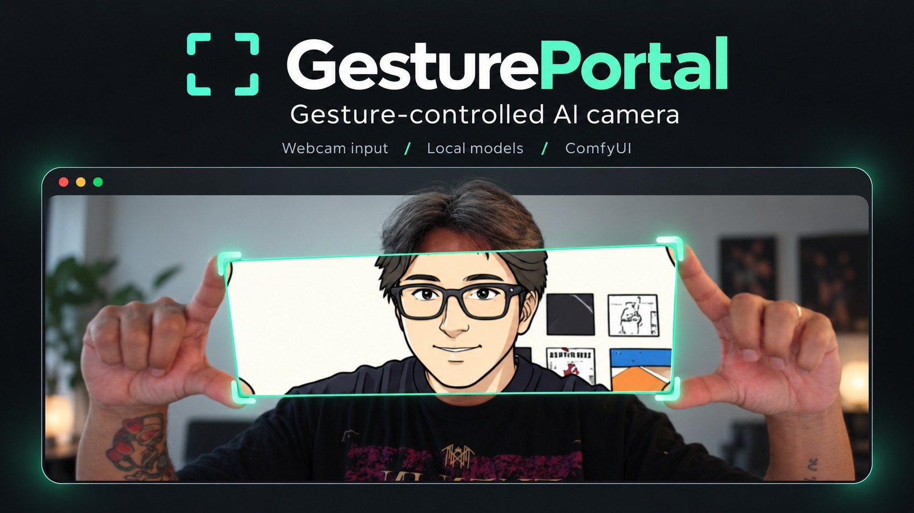
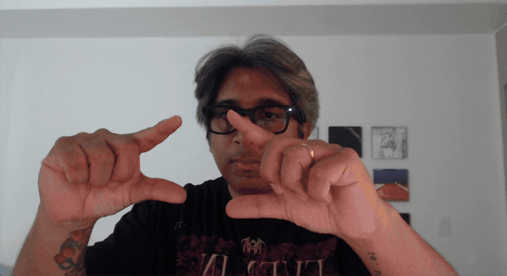
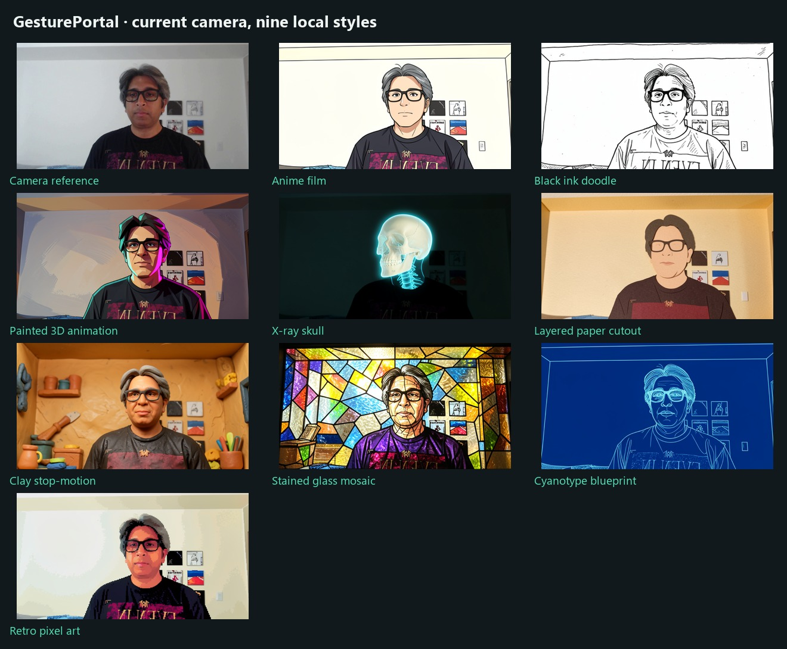
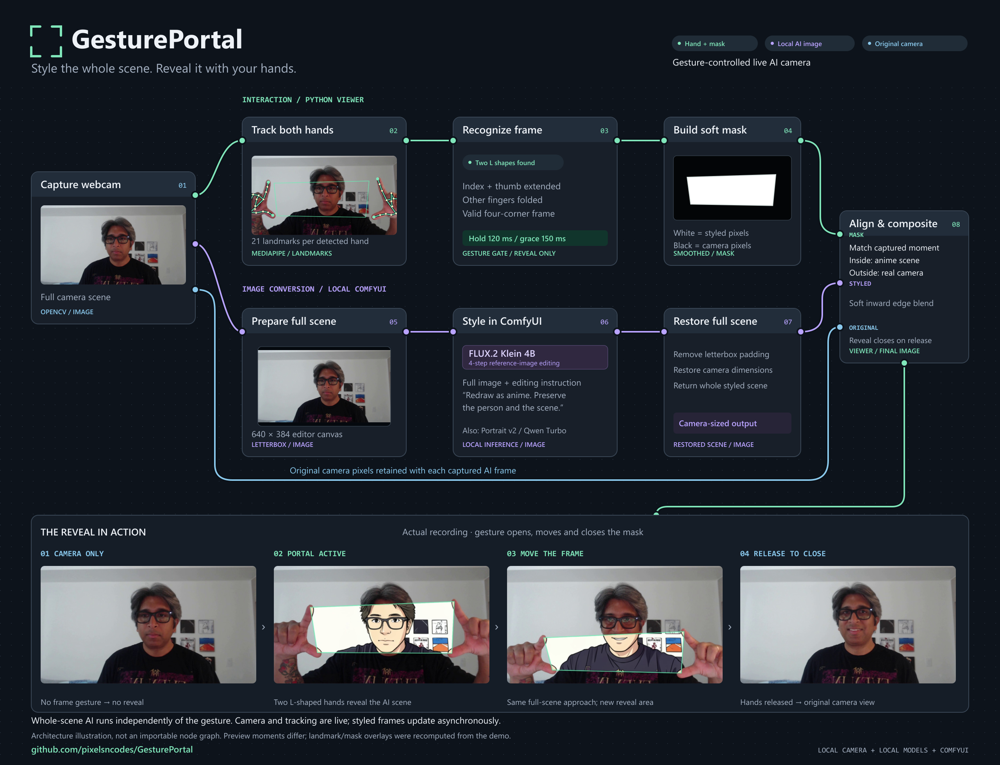
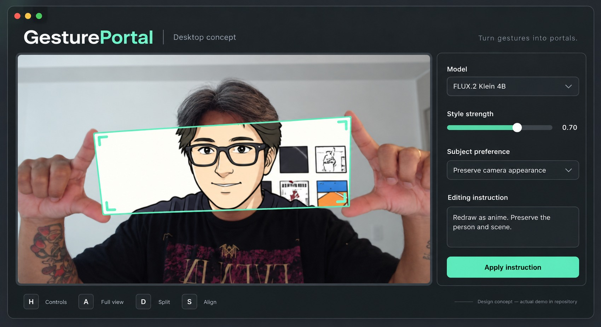
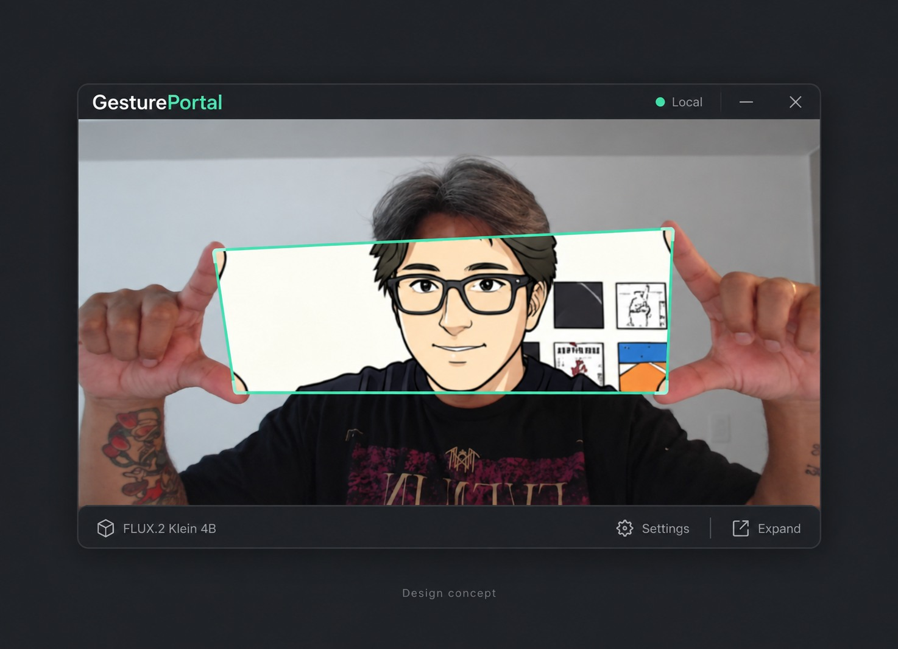
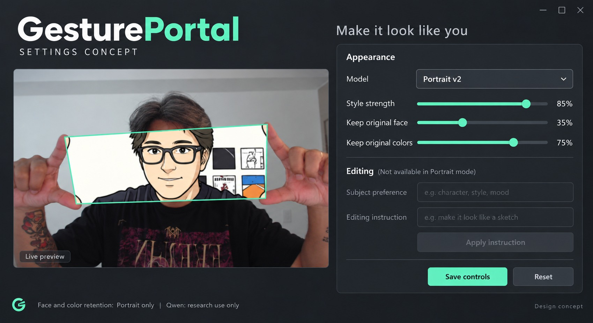

# GesturePortal

**Make a frame with your hands. Reveal another version of your world.**

GesturePortal is a local webcam experiment built with Python, MediaPipe and ComfyUI. Hold up two L-shaped hands to open a movable window into an AI-styled version of your camera feed. Everything outside that window stays real.

The full camera image is converted first. Your gesture controls the reveal mask, so moving the window does not change the scene sent to the model.

**Windows prototype · Local inference · Webcam gestures · Three model presets**

## See it working



*Actual prototype output, cropped from the supplied recording. The GIF is sampled at 6 fps and retains the original timing; this is not the AI generation rate.*

[Watch the updated desktop recording](https://github.com/pixelsncodes/GesturePortal/blob/main/docs/assets/GesturePortal-desktop.mp4) · [Widget video](https://github.com/pixelsncodes/GesturePortal/blob/main/docs/assets/GesturePortal-widget.mp4) · [Settings video](https://github.com/pixelsncodes/GesturePortal/blob/main/docs/assets/GesturePortal-settings.mp4) · [All nine GIFs and screenshots](docs/gallery.md)

## What works today

- Two-hand tracking with a smoothed, tilted four-corner portal and soft mask edges.
- Whole-scene translation with Portrait v2, FLUX.2 Klein 4B, or Qwen Image 2.1 Turbo.
- Portal, full styled view, and real/styled split comparison.
- Unified desktop interface with model settings, style blending, appearance retention, and editing instructions.
- Compact widget mode, always-on-top option, and an animated model loader.
- Component-by-component loading feedback and measured 0–100% workflow progress.
- Nine visual styles on the existing editor: anime, doodle, painted 3D, X-ray skull, paper, clay, glass, blueprint and pixel art.
- FLUX by default, automatic no-gesture warm-up, and immediate mask reveal once ready.
- Frame alignment: the camera image, gesture and AI result can share the same captured moment.
- Local video replay, optional recording, and explicitly saved source/result comparisons.

The updated application has a camera-first Tk desktop interface and a compact widget mode, following the earlier mockups. Its UI runs in a separate process from OpenCV capture and inference. AI conversion updates asynchronously and is slower than the camera and hand tracking.


[Updated UI, warm-up behavior and test results](docs/ui-update.md) · [Compact widget](docs/assets/widget-ui.png)



Choose **Visual style** in Settings with FLUX or Qwen selected. The nine presets
reuse the image editor; no additional model downloads are needed. The comparison
above was generated locally with FLUX from one original camera frame. Presets
follow the current person's age and visible accessories rather than assuming
the creator's appearance. X-ray is
an imagined skull effect. [Style guide and loading progress](docs/styles.md).

## How it works



*ComfyUI-style architecture overview with actual video frames and recomputed landmark/mask overlays. Gesture tracking and compositing run in the Python viewer; the styling branch runs in ComfyUI. [Download PNG](docs/assets/workflow-explainer.png) · [Editable SVG](docs/assets/workflow-explainer.svg)*

The viewer keeps one AI request running and one newest frame waiting. Older waiting frames are replaced, and obsolete results are discarded when settings or models change. A separate UI process keeps the camera preview, sliders and dropdowns responsive during generation. At startup and after a model switch, the selected workflow runs before any gesture. The loader disappears when a usable styled frame arrives; the default live reveal uses the current hand mask with the cached result.

FLUX and Qwen receive the camera image as a reference along with an editing instruction. There is no separate captioning LLM or automatic gender detection. Subject preferences are manual. Portrait v2 uses image translation and face refinement without a text prompt.

[Read the architecture](docs/architecture.md)

## Models and measured speed

Test machine: **Core i9 · RTX 5070 Ti / 16 GB VRAM · 32 GB RAM · Logitech webcam**, using ComfyUI 0.38.0 and PyTorch 2.14.1 / CUDA 13.0.

| Preset | Approach | Warm image round trip | Approx. AI updates |
| --- | --- | --- | --- |
| Portrait v2, tuned | AnimeGANv2 face-paint translation and aligned face refinement | 0.28 s at 768 × 432 | 3.6/sec |
| FLUX.2 Klein 4B | Distilled reference-image editor, 4 steps | 1.1–1.4 s at 640 × 384 | 0.7–0.9/sec |
| Qwen Image 2.1 Turbo | Viggle v0.3 merged INT8 editor, 6 steps | 2.4–2.6 s at 640 × 384 | about 0.4/sec |

These are small local development measurements, including image transport, encoding and decoding; they exclude camera capture and hand tracking. Portrait's result is from an earlier warm benchmark; the editors used one to three warm repeats. Initial loading and model switches can take tens of seconds. `camera_fps: 30` and `max_ai_fps: 30` are requested rates/caps, not achieved AI performance.

Portrait is a fast painterly fallback. FLUX gives a stronger anime redraw. Qwen provides another reference-editing option at higher latency. All three can change facial proportions, colors and scene details. Fixed seeds do not eliminate flicker: these are image models, not temporally trained video models.

Model weights are downloaded separately. [FLUX.2 Klein 4B](https://huggingface.co/black-forest-labs/FLUX.2-klein-4B) is Apache-2.0; [AnimeGANv2's PyTorch implementation](https://github.com/bryandlee/animegan2-pytorch) is MIT; [Qwen Image 2.1](https://huggingface.co/Qwen/Qwen-Image-2.1) and [Viggle Turbo](https://huggingface.co/Viggle/Qwen-Image-2.1-viggle-turbo) use research licensing. Qwen is an explicit opt-in for non-commercial research/evaluation. [Component notices and licensing](docs/licensing.md)

## Get started

Use **Windows, Python 3.12 for the viewer, and a separate compatible ComfyUI installation**. The tested AI configuration uses a 16 GB NVIDIA GPU and ComfyUI's ordinary memory offloading. The scripts currently retain the developer machine's ComfyUI defaults; supply your own paths as shown in the setup guide.

```powershell
git clone https://github.com/pixelsncodes/GesturePortal.git
cd GesturePortal

# Point this at your installed Python 3.12 executable.
.\Setup.ps1 -Python 'C:\Python312\python.exe'

# In one terminal, start your existing ComfyUI installation.
.\Start-Comfy.ps1 -ComfyRoot 'D:\ComfyUI\ComfyUI' `
    -Python 'D:\ComfyUI\python_embeded\python.exe'

# In a second terminal, open the webcam viewer.
.\Start-Portal.ps1
```

Default setup downloads Portrait v2 + FLUX. Qwen is optional: after reading its license, run `.\Setup.ps1 -QwenResearch`. For hand tracking alone, use `.\Setup.ps1 -HandOnly` followed by `.\Launch-Portal.ps1 -PreviewOnly`.

[Full setup, downloads and troubleshooting](docs/setup.md)

## Controls

| Key | Action |
| --- | --- |
| **1 / 2 / 3** | Portrait v2 / FLUX / Qwen |
| **H** | Show or hide settings |
| **W** | Compact widget / full desktop |
| **R** | Retry a failed model load |
| **P** | Return to gesture portal |
| **A** | Full styled view / gesture portal |
| **D** | Real/styled split comparison |
| **S** | Toggle captured-frame alignment |
| **[ / ]** | Decrease/increase style blending |
| **C** | Save a matched source/result comparison locally |
| **Space** | Pause/resume AI |
| **Q / Esc** | Close |

Click the camera preview to give it keyboard focus for these shortcuts. Typing in the instruction field does not trigger them. Hold both index fingers up and thumbs inward, with the remaining fingers folded, to form the frame.

**Style strength** blends the generated image with the source. **Keep original face/colors** apply to Portrait only. For FLUX or Qwen, choose a **Visual style**, or open **Customize instruction** and press **Apply instruction** after editing. Select **Preserve camera appearance**, **Male**, or **Female** as a manual rendering preference. **Save settings** persists preferences; **Reset** restores the selected model's defaults. Use 100% style strength for fully monochrome presets.

## Interface concepts

The following AI-generated presentations explore a cleaner interface. They are illustrative artwork, not screenshots of implemented versions, and their previews are not model-quality benchmarks.

### Full desktop concept



### Compact widget concept



### Settings concept



[Actual screenshots, original artwork and media provenance](docs/gallery.md) · [Artwork prompts](docs/artwork-prompts.json)

## How it was developed

Created by **Kazi Ahmed / [pixelsncodes](https://github.com/pixelsncodes)** through iterative prototyping with OpenAI Codex assistance and hands-on webcam testing. The project began with a reference-video idea, then evolved through gesture tracking, local ComfyUI integration, face-quality comparisons, and live controls.

The key change came from a simple observation: generate the whole styled scene, then use the hands to reveal it. Earlier crop-based conversion changed the model's context whenever the frame moved. Early DCT, Portrait v1 and SD 1.5 LCM/ControlNet experiments were removed after poor likeness results; the current presets keep Portrait v2 and add native reference editors.

[Development story and validation](docs/development.md)

## Repository map

| Location | Purpose |
| --- | --- |
| `run_portal.py`, `portal/` | Camera, gestures, compositing, controls and backend client |
| `custom_nodes/gesture_portal/` | In-memory ComfyUI transport, Portrait refinement and editor helpers |
| `config*.json` | Viewer/model presets |
| `workflows/` | ComfyUI frontend graphs and API equivalents |
| `download_*.py`, `Setup.ps1` | Explicit model downloads and viewer setup |
| `tests/` | Geometry, image alignment, controls and worker regressions |
| `docs/` | Setup, architecture, development, gallery and publication assets |

Webcam frames are exchanged through memory on loopback; no remote inference service or API key is used. Model setup requires downloads. Snapshots/recordings are written only when explicitly requested; the backend can write its own logs and metadata. The promotional artwork was generated separately and does not describe the runtime inference path.

Built on [ComfyUI](https://github.com/Comfy-Org/ComfyUI), [MediaPipe](https://github.com/google-ai-edge/mediapipe), [OpenCV](https://github.com/opencv/opencv), [AnimeGANv2](https://github.com/bryandlee/animegan2-pytorch), [Black Forest Labs](https://huggingface.co/black-forest-labs), [Qwen](https://huggingface.co/Qwen) and [Viggle](https://huggingface.co/Viggle). See [licensing and attribution](docs/licensing.md) for the applicable component terms.
