# Demo, screenshots and concepts

## Current visual styles and measured loading

The comparison uses the same unstylized camera frame at 9 seconds in the
supplied 42.8-second recording, rendered through the local four-step FLUX editor. The two UI
captures show the implemented app using that source and its generated doodle.
These are real local-model outputs and app captures. They demonstrate a single
frame per style rather than continuous video quality. [Style guide](styles.md).

## Animated examples of every style

Each GIF records actual asynchronous FLUX updates in the implemented app. It
starts with full-style output, then switches to the hand-controlled portal.
The same original camera segment is replayed at its original timing. GIF
playback is 10 fps; the model generated four or five images during each 6.1-second
clip. These are replay demonstrations, not nine simultaneous webcam sessions.

| Anime film | Black ink doodle | Painted 3D animation |
| --- | --- | --- |
| 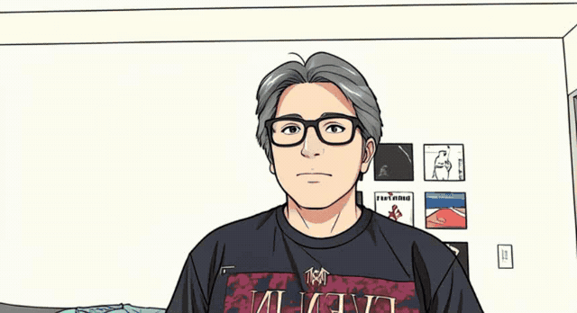 | 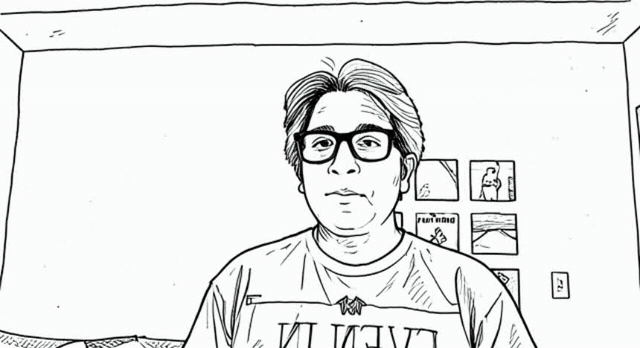 | 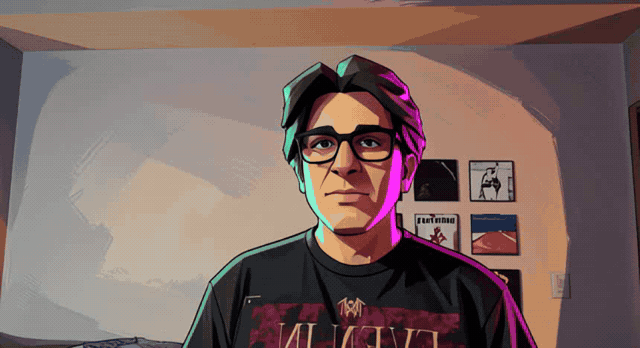 |

| X-ray skull | Layered paper cutout | Clay stop-motion |
| --- | --- | --- |
| 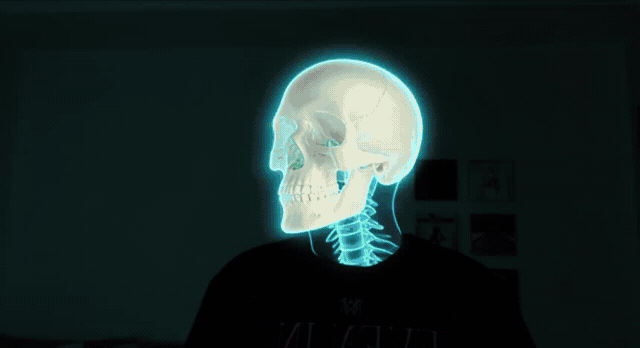 | 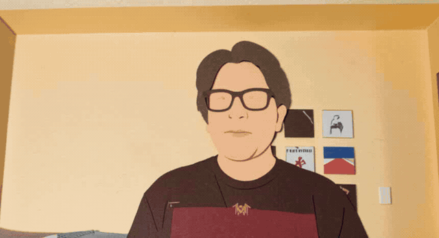 | 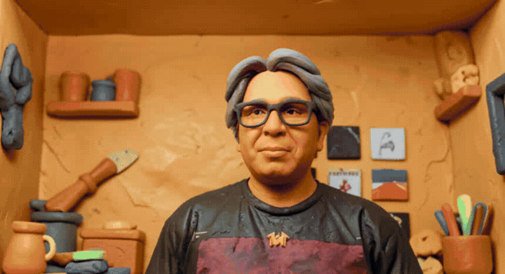 |

| Stained glass mosaic | Cyanotype blueprint | Retro pixel art |
| --- | --- | --- |
| 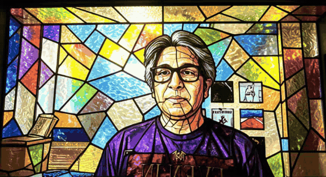 | 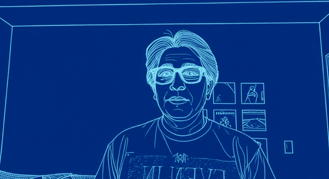 | 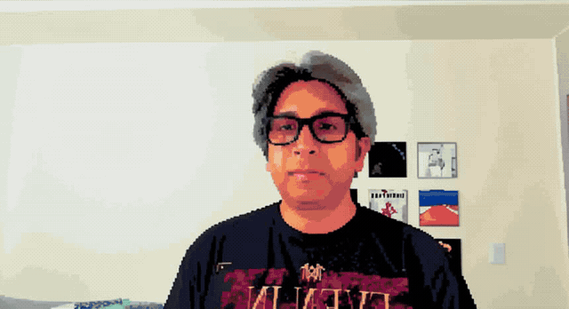 |

[Current recording results and source details](media-validation-results.json).

## Implemented desktop and widget

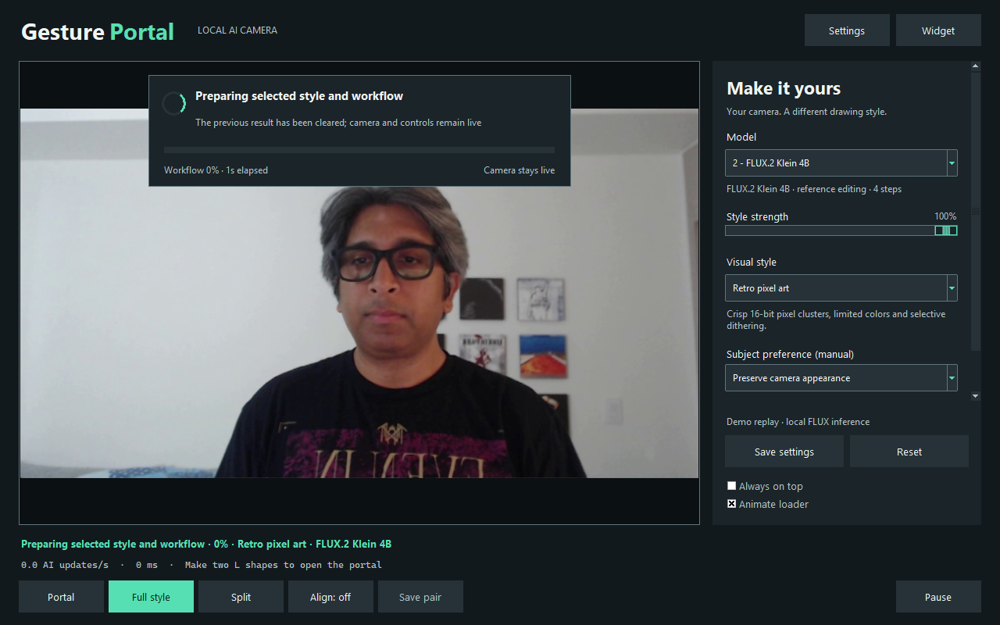

Actual captures of the implemented Tk interface during local FLUX replay tests.
The source is the original camera region before the old recording's first anime
result. Old mint frame outlines remain in the replay input; gesture masks are
recomputed locally. These captures show current app behavior, including normal
inference delay and possible pose mismatch. [Update and validation](ui-update.md).

### Current UI videos

| Recording | Content |
| --- | --- |
| [Full desktop MP4](https://github.com/pixelsncodes/GesturePortal/blob/main/docs/assets/GesturePortal-desktop.mp4) | Actual UI with style preparation, all nine styles and live gesture compositing |
| [Widget MP4](https://github.com/pixelsncodes/GesturePortal/blob/main/docs/assets/GesturePortal-widget.mp4) | Compact portal view with continuing local inference |
| [Settings MP4](https://github.com/pixelsncodes/GesturePortal/blob/main/docs/assets/GesturePortal-settings.mp4) | Style controls and expansion/scrolling of the custom instruction editor |

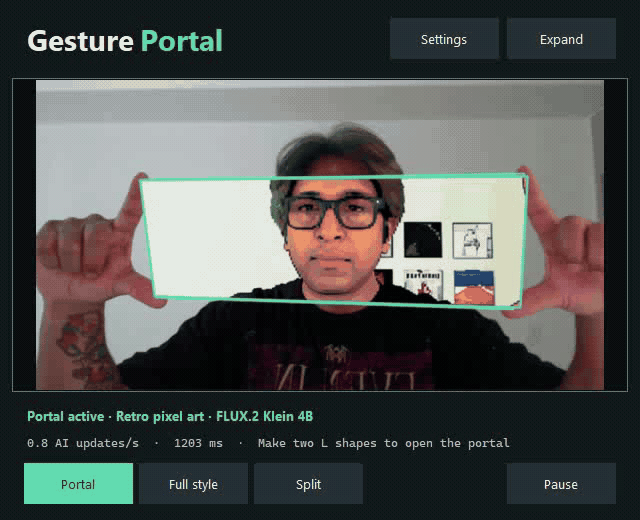

### Settings and custom instructions

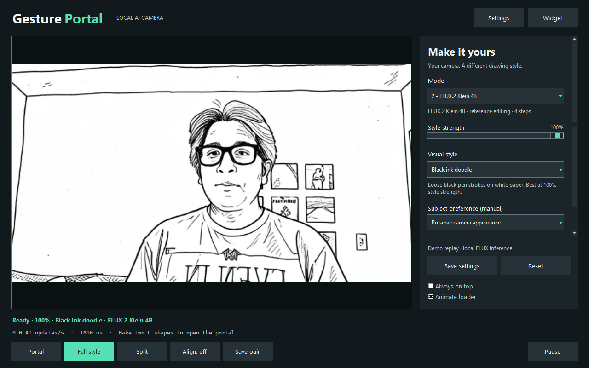

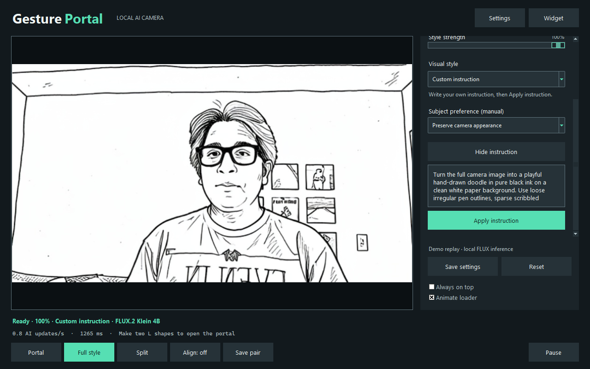

### Appearance regression check

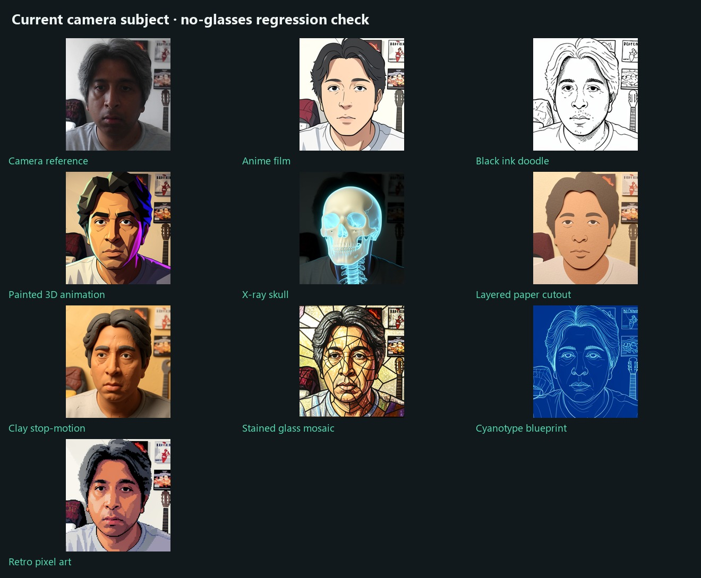

All nine styles received the same supplied no-glasses camera image. This checks
the updated accessory-neutral instructions with the creator's image, not a
child's image. Exact old built-in prompts are migrated; custom prompts remain
under user control. Image-model likeness and accessory preservation can still
vary.

## Earlier app recording

The close-up GIF uses seconds 1–10.5 of the supplied 11.8-second recording. It crops the webcam viewer and samples at 6 fps without speeding up playback. The displayed AI updates remain those of the actual application.

[Watch the full MP4 on GitHub](https://github.com/pixelsncodes/GesturePortal/blob/main/docs/assets/GesturePortal.mp4) · [Download MP4](https://raw.githubusercontent.com/pixelsncodes/GesturePortal/main/docs/assets/GesturePortal.mp4)

The published MP4 contains the full recording, resized from 2560 × 1440 to 1920 × 1080, encoded as H.264 at its original 30 fps, and exported without audio. The source recording remains untouched locally. The 30 fps describes recording playback, not AI throughput.

### Desktop capture

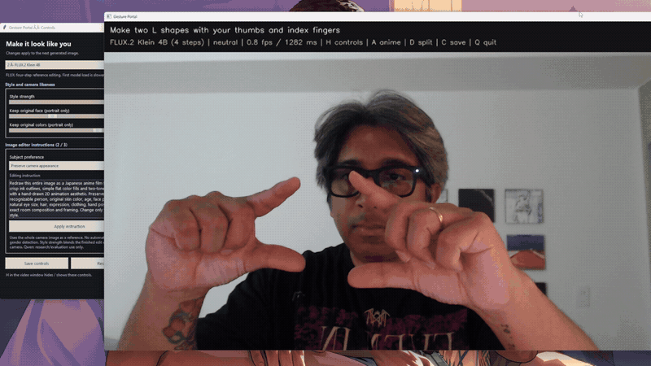

This shows the earlier two-window prototype, including the partially overlapped controls panel. It is not the unified desktop concept below.

### Viewer screenshot

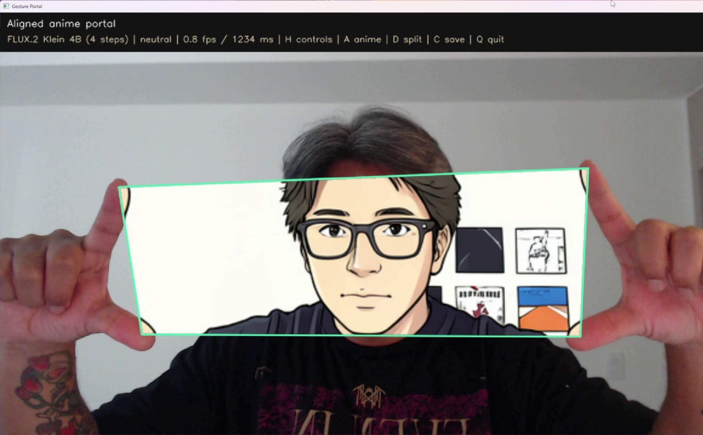

Cropped from the recording at approximately 3 seconds. The visible HUD reports the measured AI update rate for that moment.

### Supplied screenshots

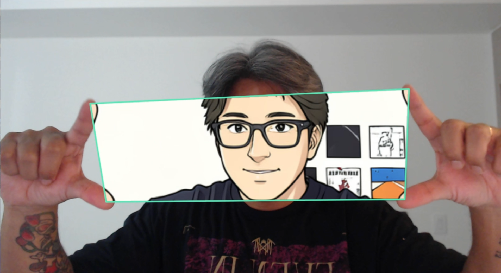

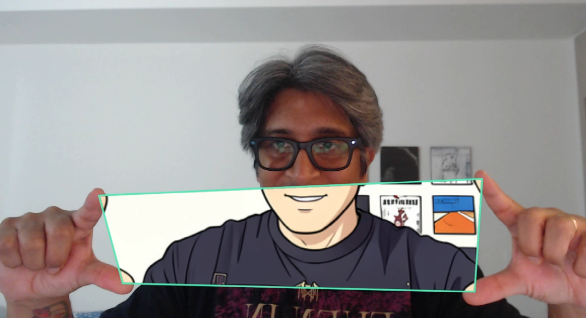

These are the supplied screenshots, copied without creative edits.

## Workflow explainer

[Full-resolution PNG](assets/workflow-explainer.png) · [Editable SVG](assets/workflow-explainer.svg)

The diagram shows camera capture, MediaPipe tracking, L-gesture activation, the soft mask, full-scene reference editing, restoration, frame alignment and compositing. The bottom sequence shows the actual reveal opening, moving and closing.

This is a diagram of the application architecture, not an importable ComfyUI node graph. Gesture detection and masking run in the Python viewer; only the image conversion branch runs in ComfyUI. The SVG was drawn directly for exact labels and wiring, rather than generated as artwork.

Preview screenshots come from the supplied recording at different moments. MediaPipe landmarks and the illustrative mask were recomputed locally from the 1.8-second preview frame. They are explanatory overlays, not a recorded intermediate tensor. In alignment mode, the real application matches the source, gesture and styled result to the same captured moment. Whole-scene AI generation continues independently of whether the reveal is active.

## Promotional artwork

[Original PNG](assets/promo.png)

AI-generated branding artwork informed by the actual screenshot. This is an illustration of the product idea, not evidence of a new model result.

## Interface mockups

All three screens are AI-generated **design concepts**. They illustrate a possible future layout; they guided the implemented desktop and widget above. The original artwork remains illustrative rather than an exact UI screenshot. Rendered preview content is illustrative and does not demonstrate the quality of the selected model.

### Full desktop

[Original PNG](assets/mockup-full.png)

### Compact widget

[Original PNG](assets/mockup-widget.png)

### Settings

[Original PNG](assets/mockup-settings.png)

## Media provenance

| Published asset | Source / process |
| --- | --- |
| `GesturePortal.mp4` | Supplied `output/GesturePortal.mp4`; full-duration H.264 web export |
| `demo-portal.gif` | Same recording; viewer crop, 6 fps, 720 px wide, original timing |
| `demo-desktop.gif` | Same recording; desktop view, 6 fps, 800 px wide, original timing |
| `demo-viewer.jpg` | Same recording, approx. 3 s; cropped viewer with HUD |
| `demo-portal.png` | Supplied `Screenshot 2026-10-06 220522.png` |
| `demo-portal-low.png` | Supplied `Screenshot 2026-10-06 220514.png` |
| `promo.png`, `mockup-*.png` | Built-in image generation using the second screenshot as reference |
| `promo.jpg`, `mockup-*.jpg` | Smaller web exports of the generated PNG originals |
| `workflow-explainer.png`, `.svg` | Directly drawn architecture diagram; actual recording previews at 0, 1.8, 3, 5 and 11 s; locally recomputed hand landmarks and mask |
| `style-comparison.jpg` | Original camera frame at 9 s plus nine actual FLUX results; 640 × 384 inference restored to 860 × 469 |
| `appearance-preservation.jpg` | Creator's supplied no-glasses camera image plus the nine revised local FLUX style results |
| `style-*.gif` | Actual viewer output during local replay inference; source seconds 9–15 from `2026-10-06 21-52-07.mp4`, camera crop only, 10 fps, original timing |
| `GesturePortal-desktop.mp4`, `-widget.mp4`, `-settings.mp4` | Captures of the implemented app's own window during local inference/replay and settings interaction; H.264 exports, no audio |
| `desktop-ui.png`, `widget-ui.png`, `styles-ui.png`, `component-loading-ui.png`, `loader-ui.png`, `settings-ui.png`, `custom-instruction-ui.png`, `style-*-ui.png` | Current implemented Tk window captured directly, including if another app overlaps it |
| `widget-demo.gif` | 10 fps derivative of the current compact-widget recording |

Exact artwork prompts are preserved in [artwork-prompts.json](artwork-prompts.json). Promotional image generation was separate from the application's entirely local inference workflow.
