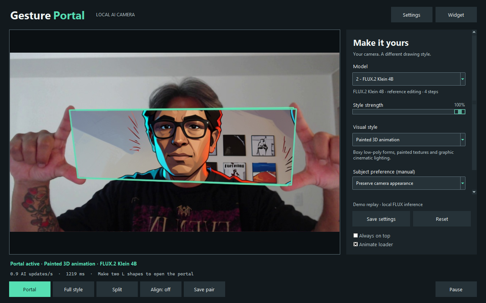
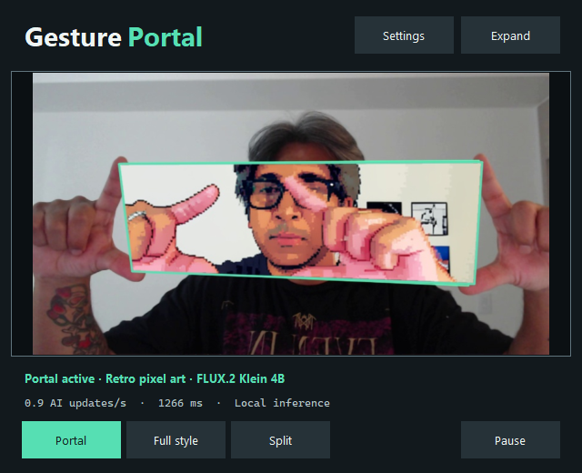
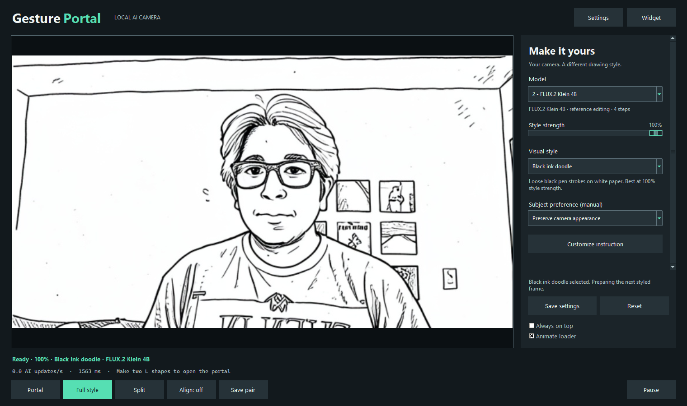

# Desktop UI and automatic model warm-up

FLUX.2 Klein 4B is the default. Starting GesturePortal or selecting a model
prepares the real camera workflow without requiring a hand gesture. The loader
shows backend checking, model loading and fresh-frame preparation. Once Ready
appears, a gesture reveals the cached styled scene using the current hand mask.
The model still updates at its actual inference rate; motion inside the styled
scene can lag the live camera. Optional Align mode trades immediate motion for
a source/mask/result from the same capture.

The charcoal/mint desktop follows the original mockup, with a large camera
preview, scrollable settings and fixed save/reset controls. Model-specific
options appear only when relevant. The compact widget shares the same camera
and model session. Settings expands it; Expand returns to the full window.
Always on top and loader animation are optional.

The [UI plan](ui-update-plan.md) applies UI UX Pro Max's consistency,
loading-feedback and accessibility guidance plus Taste's focused redesign
approach. Those skills are development guidance, not runtime dependencies.
Implementation stays in Python/Tk, with the entire UI in a separate process.
No model weights, cloud service or captioning LLM were added for this update.

## Validation

Development machine: Core i9, RTX 5070 Ti 16 GB, 32 GB RAM and Logitech webcam.

- 34 viewer/UI checks passed, plus both tensor-node checks in ComfyUI's runtime.
- Real local FLUX warmed with zero detected hands. A first cold backend test
  reached Ready in about 42.5 seconds, including its fresh-frame follow-up.
  Reusing the already-warm backend took about 1.5 seconds.
- Loader rotation continued during inference. Model switches cleared previous
  readiness/results. Portrait, Qwen and FLUX all reached Ready; the Qwen switch
  took about 44 seconds and FLUX after Qwen about 36 seconds in this test.
  These are individual startup/offloading observations, not steady-state speed
  benchmarks. Qwen temporarily used substantially slower frame updates after
  the switch, so it should not be treated as a fast webcam preset.
- Revealing a cached no-gesture result used no additional AI request. The local
  mask/composite call took about 20 ms at 860 × 469; this excludes tracking,
  camera capture, UI rendering and gesture activation hold time.
- The complete app replay processed 594 frames with 21 generated images and
  composited all 244 frames where a gesture was active. It started with a
  no-hands segment, then replayed the recorded gesture sequence.
- A separate physical-webcam check captured and tracked 60 frames successfully.
- Tests cover stale cold results, backend startup retries, errors/retry,
  obsolete results after selection, bounded scheduling, widget/settings
  transitions, keyboard typing, contrast and live control input.

[Machine-readable results](ui-validation-results.json)

The earlier acceptance run used replayed demo frames, some already stylized;
it validated integration and layout rather than improved likeness. The original
recording and generated mockups remain in the gallery for context.

The screenshots on this page have since been refreshed from the current
style/appearance update. Their source is an original camera segment before
the recorded anime conversion appears; the earlier test observations above
retain their original scope. [Current GIFs and UI recordings](gallery.md).

The pre-UI full backup remains intact. Changes are saved as separate backend,
desktop and validation Git checkpoints on `ui-warmup-desktop`.

## Style selector and component progress update

The current interface adds nine styles and a collapsible custom-instruction
editor. Its loader reports actual backend components and measured 0–100%
workflow completion, including cached nodes and sampling steps. The percentage
can pause during a long load; it is not a time estimate. Model/style changes
clear the previous result, and 100% appears only when a usable frame is ready.

All nine styles rendered with local FLUX using the same unstylized camera frame.
Forty viewer/UI checks and both ComfyUI tensor checks passed for this update.
Saved styles and older custom instructions were checked across window restarts.
The earlier validation measurements above retain their original scope.

[Style comparison, progress semantics and render results](styles.md)
